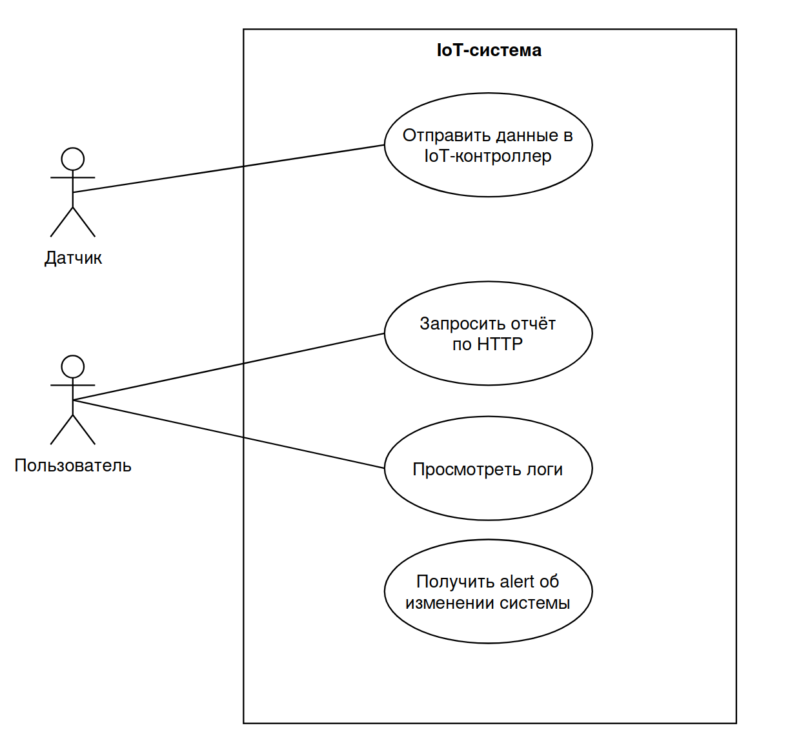

# Архитектура высоконагруженных приложений
**Название проекта:** Система мониторинга состояния серверной.  
**Исполнитель:** Попов П.С.
**Группа:** P4116  
**Преподаватели:** Перл И.А., Шилин И.А, Плюхин Д.А., Василегин В.И.

## Материалы к лабораторной работе № 1

### 2. Формирование требований
#### 2.1 Максимальное количество пользователей, поддерживаемых в каждый момент времени
- Имеется 1000 видеокарт, и, соответственно, 1000 датчиков-отправителей информации. 
- Не все видеокарты могут быть включены, поэтому будут приведены оценки снизу и сверху на количество пользователей.
	- От 1 до 1000 датчиков одновременно.
	- Один датчик = один пользователь = одна сессия.
#### 2.2 Требуемая скорость обработки запросов 
Видеокарты являются дорогостоящим имуществом, поэтому, чтобы их своевременно отключать, при, например, недопустимом повышении температуры, необходимо установить жесткие требования по скорости отклика.

Пусть:
- Допустимым временем цикла запрос-ответ является время от 0.05 до 3 секунд на один запрос.
- Допустимым временем для запроса отчёта будем считать время от 1 до 3 секунд.
- Допустимым временем пересылки сообщений между компонентами IoT-системы будем считать от 0.05 до 3 секунд на один запрос.
#### 2.3 Объем хранимой информации
Пусть поставлена задача хранить разделить логи в системе на две категории:
- За последний месяц.
- За год.
Будем хранить все сообщения-пакеты от всех датчиков за последний месяц, а за год - только сводные статистики по сформированным отчётам. 

Protobuf-сообщение на 4 float поля + timestamp будет весить ориентировочно $V = 4 \cdot sizeof(float) + sizeof(timestamp) + sizeof(assign) \approx 4 \cdot 4 + [10,16] \approx 31-36$ байт.
Итого получим оценку сверху:
Для расчета объема хранилища, необходимого для хранения сообщений, отправляемых каждую секунду с 1000 устройств, нужно учесть следующие параметры:

1. **Размер одного сообщения** — 34 байта (среднее значение для 4 полей `float` и `timestamp`).
2. **Количество сообщений в секунду**: каждое устройство отправляет сообщение каждую секунду.
3. **Количество устройств** — 1000.
4. **Время работы** — 1 год (365 дней).

##### 2.3.1.1 Оценка количества сообщений, отправленных за год
$\text{Количество секунд в году} = 365 \times 24 \times 60 \times 60 = 31,536,000 \, \text{секунд}$

$\text{Сообщений за год с одного устройства} = 31,536,000$

$\text{Сообщений за год с 1000 устройств} = 31,536,000 \times 1000 = 31,536,000,000$

##### 2.3.1.2 Оценка объема сообщений, отправленных за год
$\text{Общий размер данных} = 31,536,000,000 \times 34 = 1,073,224,000,000 \, \text{байт}$

$1,073,224,000,000 \, \text{байт} = \frac{1,073,224,000,000}{1024^3} \approx 999.89 \, \text{гигабайт}$

##### 2.3.2.1 Оценка количества отчётов за месяц
$\text{Количество секунд в месяце} = 30 \times 24 \times 60 \times 60 = 2,592,000 \, \text{секунд}$
$\text{Отчетов за месяц с одного устройства} = \frac{2,592,000}{30} = 86,400$
$\text{Отчетов за месяц с 1000 устройств} = 86,400 \times 1000 = 86,400,000$

$\text{Размер одного отчета — 34 байта.}$

$\text{Размер отчёта не изменился, т.к. содержимое отчёта}$
$\text{есть среднее по каждому из полей за период времени + timestamp.}$
##### 2.3.2.1 Оценка объема отчётов за месяц
$\text{Общий размер данных} = 86,400,000 \times 34 = 2,934,400,000 \, \text{байт}$

$2,934,400,000 \, \text{байт} = \frac{2,934,400,000}{1024^3} \approx 2.73 \, \text{гигабайт}$

#### 2.3.3 Итоги 
1. Для хранения сообщений от 1000 устройств, отправляющих по одному сообщению каждую секунду, потребуется примерно 1000 ГБ (или 1 ТБ) хранилища за год непрерывной работы.
2. Для хранения отчетов от 1000 устройств, отправляющих один отчет каждые 30 секунд, потребуется примерно 2.73 ГБ хранилища за месяц непрерывной работы.
3. Объём данных на старте положим равным нулю, т.к. предполагается генерация данных в системе в процессе её работы.

