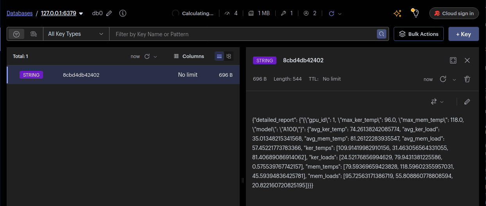
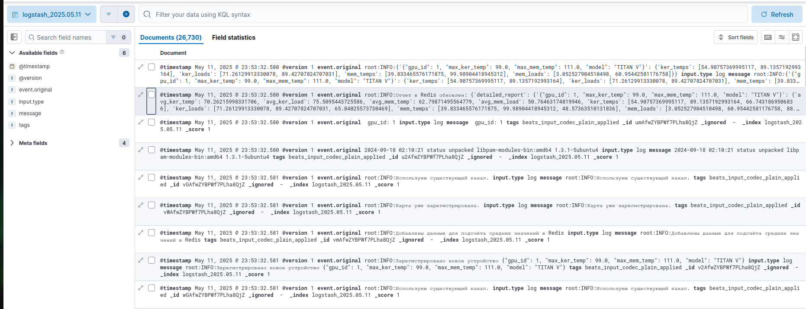

# Архитектура высоконагруженных приложений
**Название проекта:** Система мониторинга состояния серверной.  
**Исполнитель:** Попов П.С.
**Группа:** P4116  
**Преподаватели:** Перл И.А., Шилин И.А, Плюхин Д.А., Василегин В.И.

## Графические материалы к лабораторной работе № 2

Сформированы в виде uml и non-uml диаграмм в директории docs.

## Пояснение к лабораторной работе № 2

### Реализация проекта
- Реализованы три сущности `controller`, `rule_engine`, `datasim`.
- В последующих лабораторных работах `datasim` подлежит замене на `tsung` (нагрузочное тестирование).
#### Бизнес-логика микросервиса `controller`
##### Вставка данных в MongoDB и последующий температурный анализ в rule_engine
- `controller` имеет два эндпоинта: `/incoming-data`, `/report`.  
- `controller` принимает на вход пакеты `Batch`.
- Работа `controller` заключается в том, чтобы перенаправить в `rule_engine` посредством `Rabbimtq` пакеты `Batch` для последующего анализа 
на превышение максимумов температуры по информации, содержащейся в пакете `GpuInfo`.  
- Работа `controller` также заключается в том, чтобы сформировать данные для выгрузки отчёта в `Redis` (Кэширование).

##### Кэшированный отчёт
- Можно получить по адресу `/report`.
По ключу `detailed-report` в `Redis` хранятся данные по каждой видеокарте за 30 секунд:
  - Информация о каждой видеокарте `GpuInfo`
  - Температуры ядра, памяти, загрузки ядра, памяти, а также средние значения для данных метрик за последние 30 секунд.
  - Смысл кэширования заключается в том, чтобы предоставить пользователю эндпоинт, по которому он может получить
   статитческие данные с информацией о видеокарте, а также актуальные метрики за последние 30 секунд без необходимости  
   выполнять сложные агрегации в БД.

##### Бизнес-логика микросервиса `rule_engine`
- Из очереди на обменнике `AMQP.Default (direct exchange)` получает `Batch` сообщения.
- Анализирует сообщения по следуюзим правилам:
  - Если `ker_temp` > `max_ker_temp`, то сгенерировать `instant rule` и вставить эту запись в базу данных.
  - Если `mem_temp` > `max_mem_temp` больше 5 раз на протяжении последних 10 сообщений от видеокарты с данным
  `gpu_id`, то сгенерировать `ongoing rule` и вставить эту запись в базу данных.

##### Пример кэшированного отчёта в `Redis`

##### Логирование
Реализована широкая система логирования при помощи `ELK Stack + filebeat`.  
Генерация логов производится при помощи встроенного `python`-модуля `logging`.
Логи пишутся в директорию внутри контейнера `/var/log/*.log`, где `*`- непосредственно имя контейнера.
Логи отправляются в `ELK Stack` при помощи инструмента сбора логов `filebeat`.

##### Пример наличия логов в интерфейсе `Kibana`
