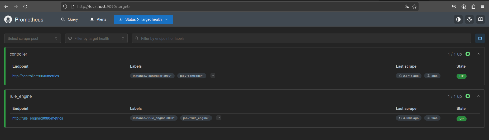
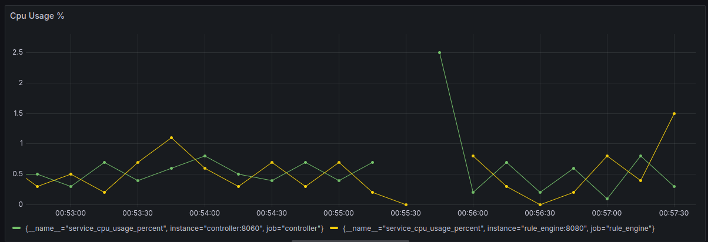
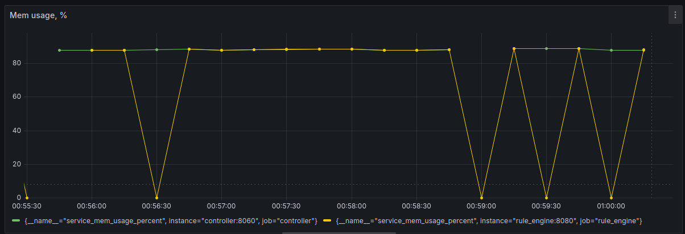
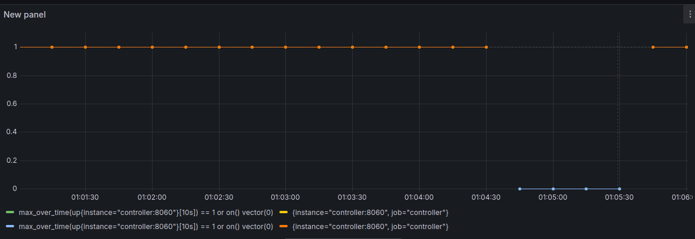
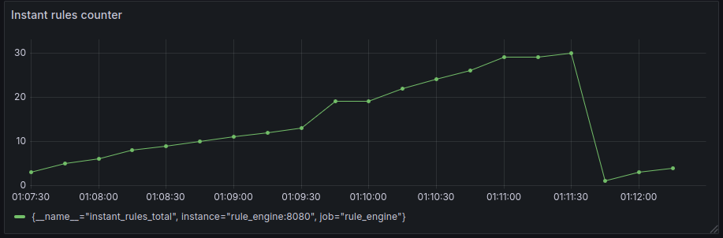
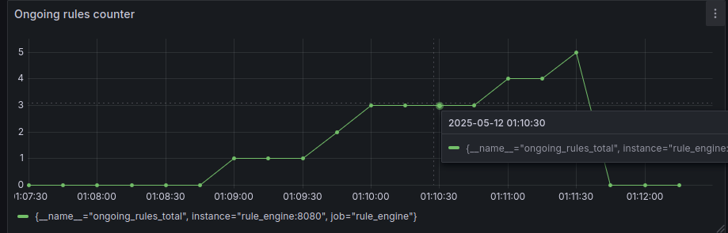
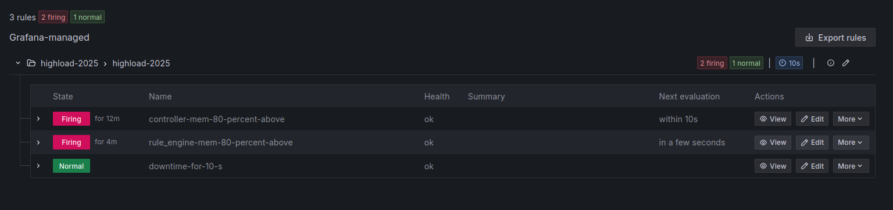
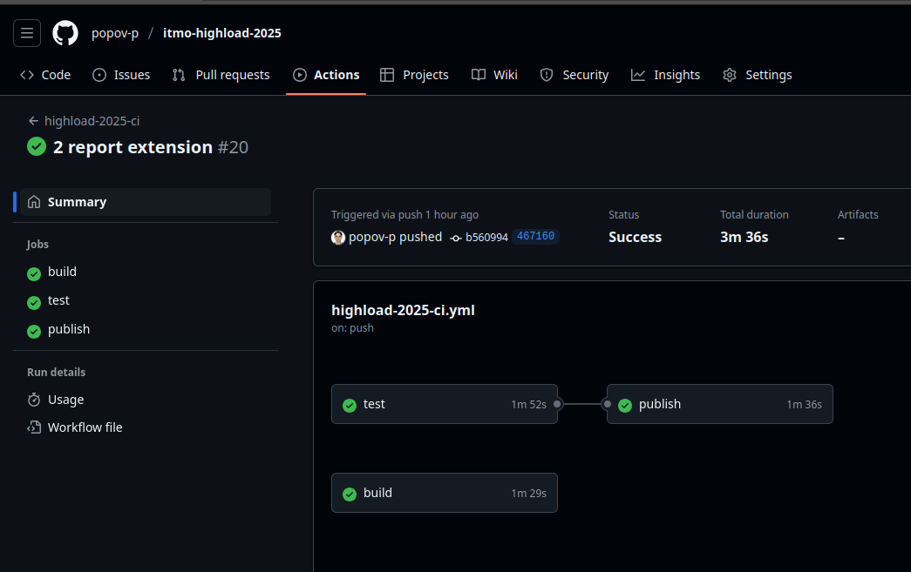
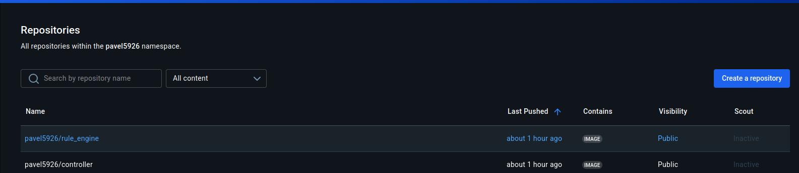

# Архитектура высоконагруженных приложений
**Название проекта:** Система мониторинга состояния серверной.  
**Исполнитель:** Попов П.С.
**Группа:** P4116  
**Преподаватели:** Перл И.А., Шилин И.А, Плюхин Д.А., Василегин В.И.

## Задание к лабораторной работе №3
- Требуется произвести контейнеризацию разработанных микросервисов посредством написания `Dockerfile` и `docker-compose.yml`.
- Требуется настроить базовый алертинг, т.е. генерировать alert в случае, если выполнено следующее из условий:
  - Загрузка процессора контейнером > 80%
  - Загрузка памяти контейнером > 80%
  - если сервис был недоступен в течение предыдущих 10 секунд.

- Требуется написать два типа тестов `unit` и `integration`-тесты.
- Требуется реализовать `CI pipeline`, который поддержит написанные тесты любым удобным средством непрерывной интеграции. 
- Требуется (опционально) загрузить контейнер в DockerHub Container Registry.

#### Контейнеризация
Разработаны `Dockerfile`, `docker-compose.yml`, содержащие все задекларированные в лабораторной работе №1 ключевые сервисы.
Исходный код прикреплён в данном репозитории и предлагается к устному комментированию автором.
#### Базовый алертинг
- Реализуется посредством внедрения в разрабатываемое решение `Prometheus` и `Grafana` как систем мониторинга.
При помощи `prometheus` с каждого инстансов образов (`controller`, `rule_engine`) будем собирать следующие метрики соответственно:
  - `rule_engine`
    - `INSTANT_RULES_COUNTER = Counter('instant_rules_total', 'Total number of instant rules processed')`
    - `ONGOING_RULES_COUNTER = Counter('ongoing_rules_total', 'Total number of ongoing rules processed')`
    - `CPU_USAGE = Gauge('service_cpu_usage_percent', 'CPU usage in percent')`
    - `MEM_USAGE = Gauge('service_mem_usage_percent', 'RAM usage in percent')`
  - `controller`
    - `CPU_USAGE = Gauge('service_cpu_usage_percent', 'CPU usage in percent')`
    - `MEM_USAGE = Gauge('service_mem_usage_percent', 'RAM usage in percent')`

###### Статус активности prometheus scraping

###### Визуализация dashboards, по которым будет настроен алертинг
- Cpu Usage per instance, %

- 
- Mem Usage per instance, %

- 
- Downtime [0 or 1]

- Instant rules counter

- Ongoing rules counter

##### Пример alerting
Естественно заметить, что если alert в состоянии `Firing` - это знчит, что он активен.  
Если в состоянии `Normal` - причины для тревоги отсутствуют.

- Ongoing rules counter

### CI. Github Workflows
Реализовано `unit` тестирования при помощи `pytest` и `unittest.mock`.
Реализовано интеграционное тестирование при помощи `pytest`, `docker`.
Реализованы проверки на каждую `HTTPException`, а также на срабатывание бизнес-логики `rule_engine`:
`instant-rules`, `ongoing rules`.

### Выгрузка образов в DockerHub 
Настроена автоматическая выгрузка контейнеров в DockerHub

- Ongoing rules counter

- 