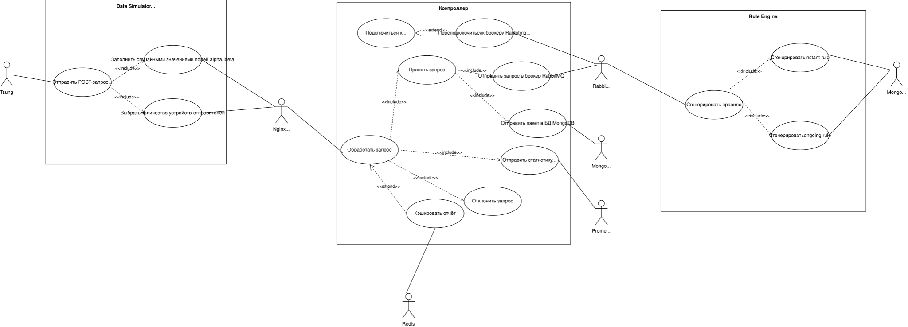

# Архитектура высоконагруженных приложений
**Название проекта:** Система мониторинга состояния серверной.  
**Исполнитель:** Попов П.С.
**Группа:** P4116  
**Преподаватели:** Перл И.А., Шилин И.А, Плюхин Д.А., Василегин В.И..  

### Краткий обзор архитектуры
Пусть имеется серверная, содержащая однотипные устройства.

Требуется разработать систему в микросервисной архитектуре, с помощью которой можно было бы делать выводы о текущем состоянии системы.

### Материалы к сдаче лабораторной работы №1
Полное описание системы приложено в AHLA-workflow.pdf.
Диаграммы прецедентов содержатся в файле AHLA-1.drawio.svg(png).

