# Архитектура высоконагруженных приложений
**Название проекта:** Система мониторинга состояния серверной.  
**Исполнитель:** Попов П.С.
**Группа:** P4116  
**Преподаватели:** Перл И.А., Шилин И.А, Плюхин Д.А., Василегин В.И.

## Задание к лабораторной работе №3
Требуется:
1. Подготовить образ контейнера Tsung для использования.  
его в сценариях нагрузочного тестирования
2. Разработать набор тестовых сценариев:
   - Много видеокарт-отправителей пакетов, мало пакетов с данными от датчика видеокарты.
   - Мало видеокарт-отправителей пакетов, много пакетов с данными от датчика видеокарты.
   - Много видеокарт-отправителей пакетов, много пакетов с данными от датчика видеокарты.
3. Выполнить нагрузочное тестирование.
    - Оценить работу системы при различных типах нагрузки.
    - Собрать данные о времени отклика, пропускной способности, использовании ресурсов и др.
    - Проанализировать результаты в архитектуре для выявления узких мест, которые можно оптимизировать.
4. Интегрировать образ с инструментом нагрузочного тестирования Tsung в CI пайплайн. 
4. После выполнения тестов сформировать отчет, который должен включать:
    Графики, отображающие динамику производительности.
    Основные выводы по результатам тестирования.
    Предложения по улучшению производительности и устранению выявленных проблем.

### Образ контейнера Tsung
Подготовлен и помещён в директорию `./tsung` относительно корня проекта.
### Сценарии нагрузочного тестирования
Подготовлены и помещены в директорию `./tsung` относительно корня проекта.
#### Изменяемыми парамтерами являются:
1. `maxcount` - количество видеокарт, отправивших сообщение за сценарий
2. `arrivalrate` за `unit` - "наплыв" видеокарт за `unit` времени. Бдуем использовать в  
качестве `unit` - секунду.
3. `total_message_count` - количество сообщений, прошедших через систему за время действия нагрузочного  
сценария.
4. `duration` - время действия нагрузочного сценария.
### Содержание сценариев:
Заметим, что система находится в "немодифицированной конфигурации", т.е.  
- Имеется ровно один экземпляр `controller`.
- Имеется ровно один экземпляр `rule_engine`. 
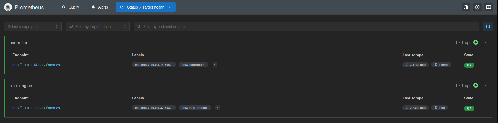
#### Много видеокарт-отправителей пакетов, мало пакетов с данными от датчика видеокарты.  
  - Характеристики сценария:
    - `maxcount = 600`, `arrivalrate=300`, `duration=30`, `total_message_count = 3000`.
##### Результаты тестирования по сценарию 
- Видно, что `controller` достигает загрузки одного ядра на `100%`. Редкие пики. Нагрузка допустима.
- Видно, что `rule_engine` имеет запас производительности в `80%`.
- Видно, что для `controller`, `rule_engine` использование памяти ` < 100 Mb`, что незначительно.
- Видно, что длительность запроса не превышает `10 msec`. 
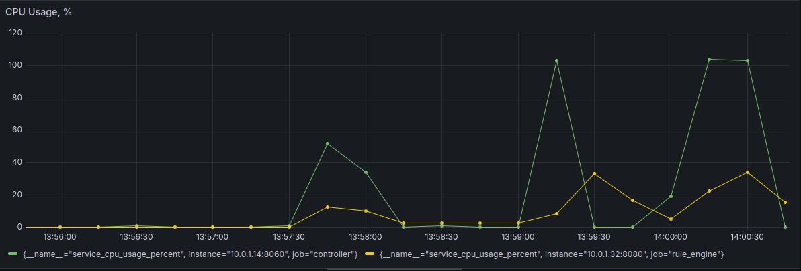
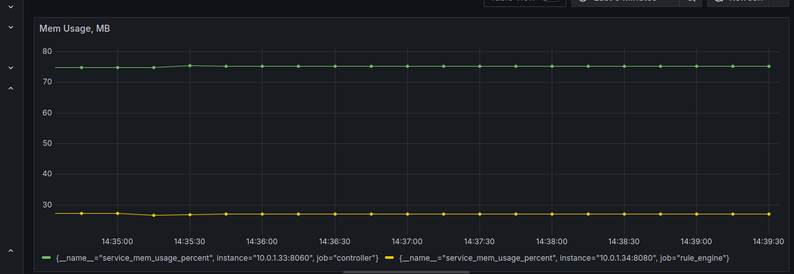
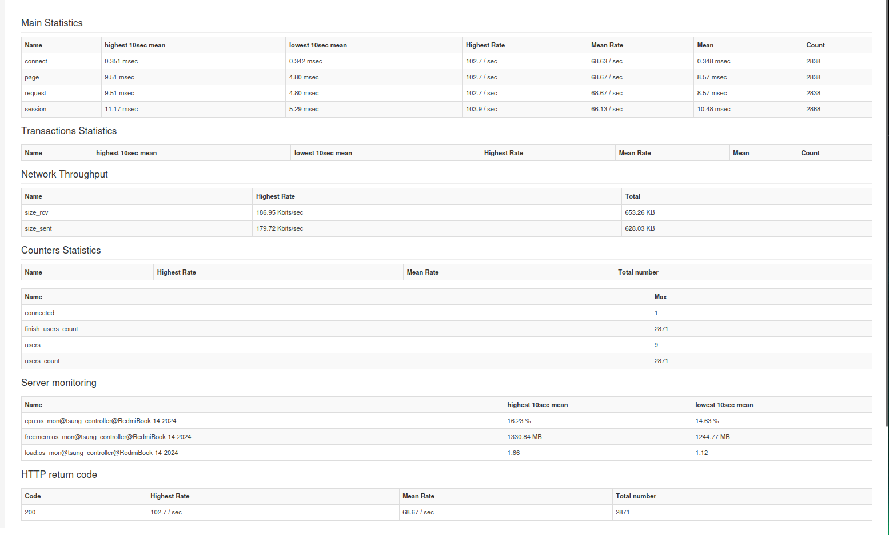
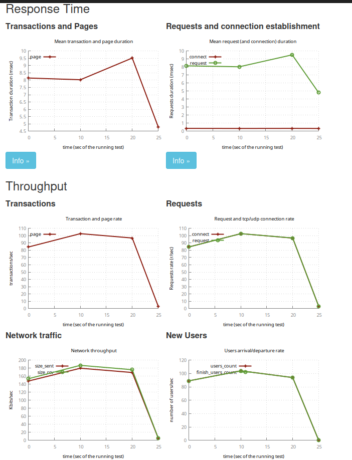
   

#### Мало видеокарт-отправителей пакетов, много пакетов с данными от датчика видеокарты.
- Характеристики сценария:
    - `maxcount = 20`, `arrivalrate=20`, `duration=30`, `total_message_count = 4000`.
##### Результаты тестирования по сценарию
- Видно, что время исполнения одного запроса приблизилось к `100` миллисекундам, что нельзя назвать  
оптимальным.
- `Controller` не успевает обрабатывать такое количество сообщений в секунду, провоцируя очередь (задержку).
- Становится очевидно, что нужно повышать производительность контроллера.
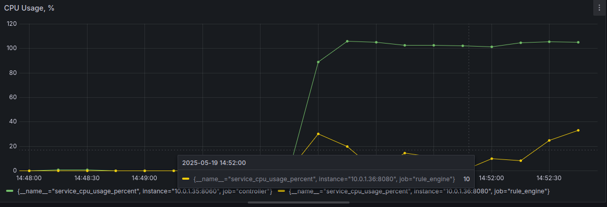
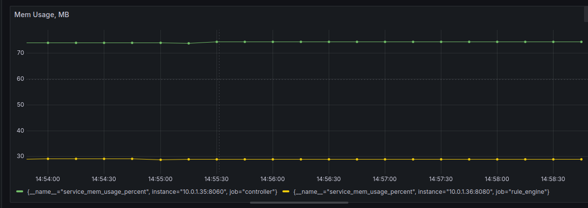
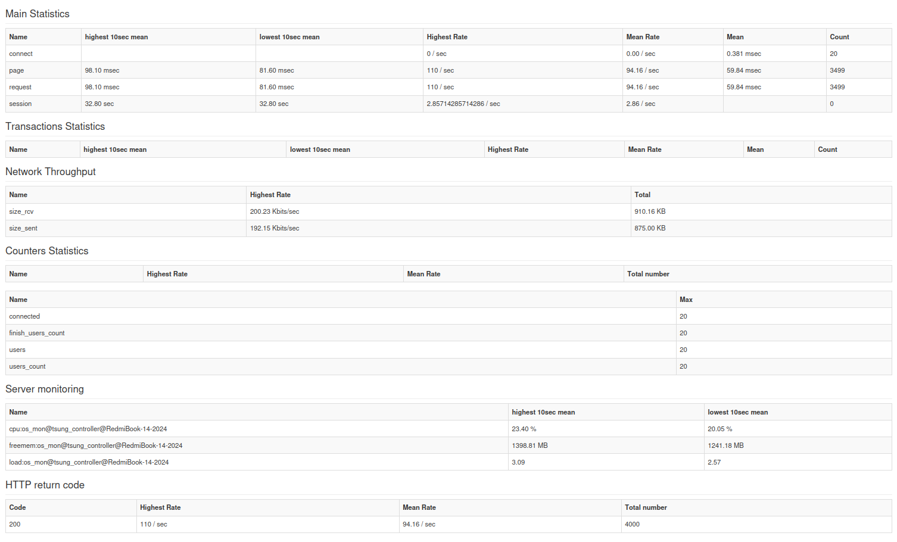
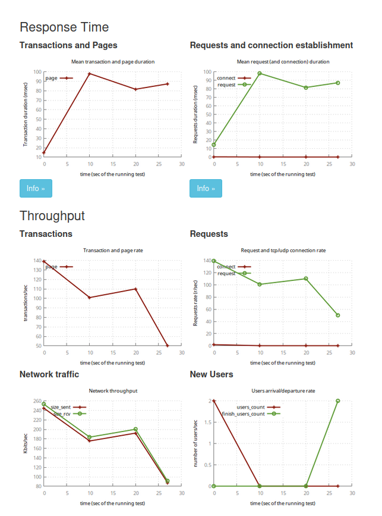

#### Много видеокарт-отправителей пакетов, много пакетов с данными от датчика видеокарты
- Характеристики сценария:
    - `maxcount = 300`, `arrivalrate=300`, `duration=30`, `total_message_count = 15000`.

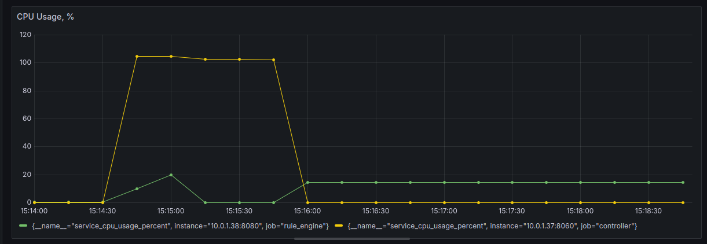
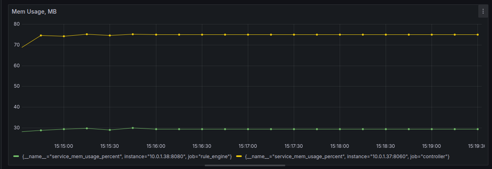
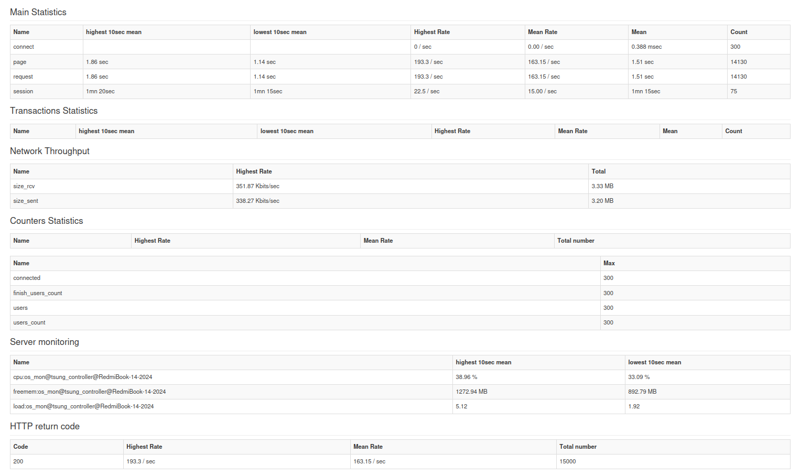
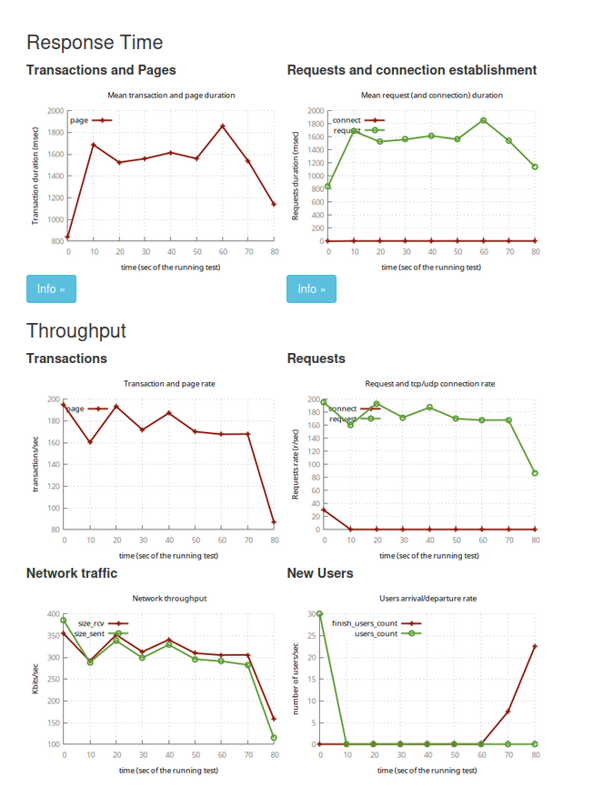

##### Результаты тестирования по сценарию
- Данный тест подтвердил наличие производительной уязвимости в контроллере.
- Результат обработки одного запроса является около `2c`, что недопустимо для системы быстрого реагирования.

### Интеграция нагрузочного тестирования в CI пайплайн
- Присутствует и реализована в `job` `test` сразу после интеграционного тестирования.
- Результаты интеграционного тестирования копируются из образа `tsung` и доступны для загрузки как `build-artifact`  
в пайплайне.

#### Общие выводы из тестируемых сценариев
- Требуется каким-либо образом повысить производительность контроллера.
- Контроллер является однопоточным, но асинхронным. 
- Требуется применить горизонтальное масштабирование для увеличения производительности.