# Архитектура высоконагруженных приложений
**Название проекта:** Система мониторинга состояния серверной.  
**Исполнитель:** Попов П.С.
**Группа:** P4116  
**Преподаватели:** Перл И.А., Шилин И.А, Василегин В.И., Плюхин Д.А.

## Задание к лабораторной работе №6
Кэширование

Реализовать кэширование данных с использованием Redis. Настройте механизм кэширования для:
    
    Уменьшения нагрузки на базу данных.
    Ускорения времени отклика системы.

Исследовать, как меняется производительность и время отклика системы при добавлении кеширования.
### Репликация и шардирование
Настроить:

    Репликацию и шардирование базы данных для повышения отказоустойчивости и масштабируемости системы.
    Выбрать асинхронный или синхронный режим в зависимости от требований к консистентности данных.

Провести нагрузочное тестирование, чтобы оценить эффективность репликации и шардирования в условиях работы под нагрузкой.

### Анализ результатов

Проанализируйте работу системы до и после внедрения:

    Кэширования.
    Репликации.
    Шардирования.

Выявите оптимальные настройки для обеспечения высокой доступности и максимальной производительности системы.

## Кэширование
Будем при помощи механизма Redis кэшировать данные о:
- Температуре ядра
- Термературе памяти
- Загрузке ядра
- Загрузке памяти

графических процессоров, а также средние значения по ним.

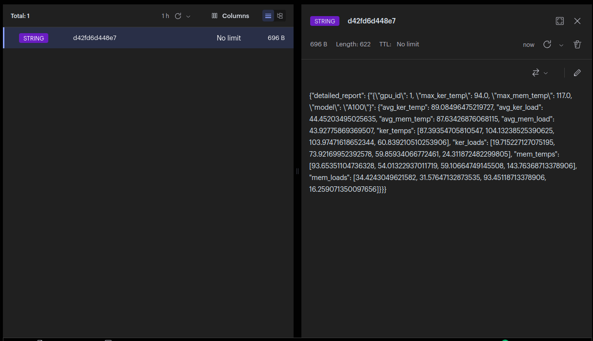

## Репликация
Настроена репликация в количестве двух `replicaSets` (понадобится далее при реализации шардирования).
### Режим репликации данных
- Используется `mongoDB` (`mongo:6`). `mongoDB` использует по умолчанию асинхронный режим.
- Используется 2 `replicaSets`по 3 копии БД.
- Количество реплик БД должно быть нечётным, чтобы не возникало ситуации `split-brain` деления голосов при падении одной из реплик.
- Используется асинхронный режим репликации БД.
Под асинхронным режимом понимается следующее правило: 
- Клиент получает код ответа `200` в том случае, если 2 из 3 реплик подтвердят вставку записи.

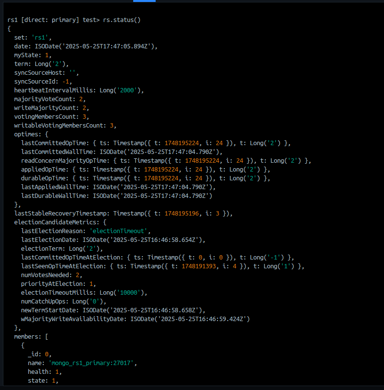
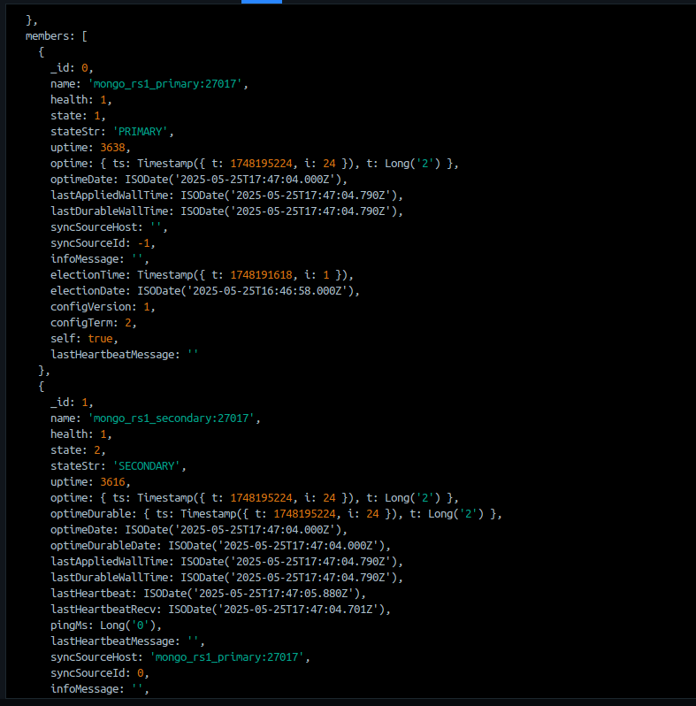
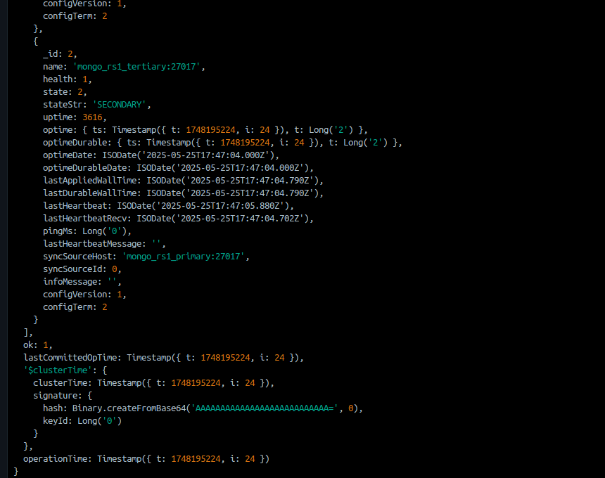

## Шардирование
Настроено шардирование на основании двух `replicaSets`.
- Для обеспечения работоспособности шардов требуется поддержать следующую инфраструктуру:
- `mongos` - роутер для транспортировки данных по `replicaSets`. Запросы идут именно на него.
- `configsvr` - сервер конфигов, запоминающий информацию о `replicaSets`. Подчиняется тем же правилам кворума, что и `replicaSets`.
- `replicaSets` - непосредственно для реализации шардирования.

- Перед началом инициализации шардов требуется вызвать `sh.enableSharding("iotdata"), sh.shardCollection("iotdata.data", { _id: 1})`
шардинг на конкретной коллекции по конкретному полю.
- Будем шардировать таблицы по ключу `_id` (стандартному для mongodb).

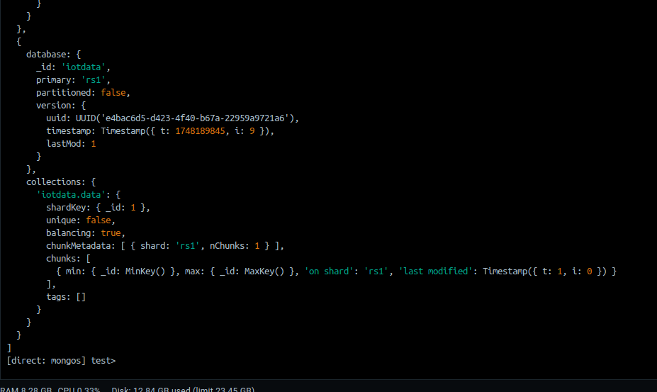

## Нагрузочное тестирование

### Кэширование
1. Реализуем эндпоинт со схожей логикой `dbwise-report`. Суть этого эндпоинта заключается в том,
чтобы повторить формирование того же самого отчёта, пользуясь средствами основной базы данных.

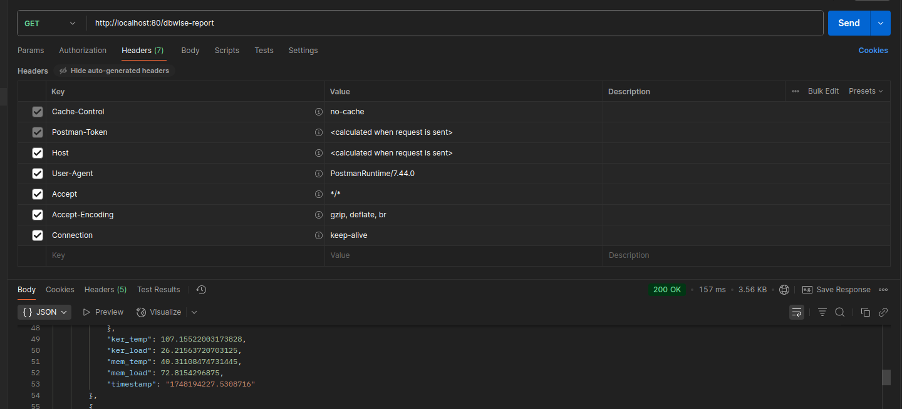
2. Теперь воспользуемся средством Redis: 
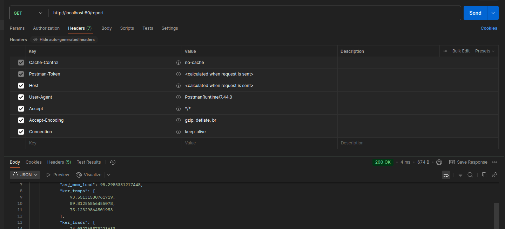

Как видно, прирост оказался равным `157/4 = 39.25` раз при количестве записей в БД `53K`.
### Репликация
Исследуем скорость работы системы после внедрения репликации.  
Имеем `replicaSet` из трёх копий БД с асинхронным механизмом репликации.

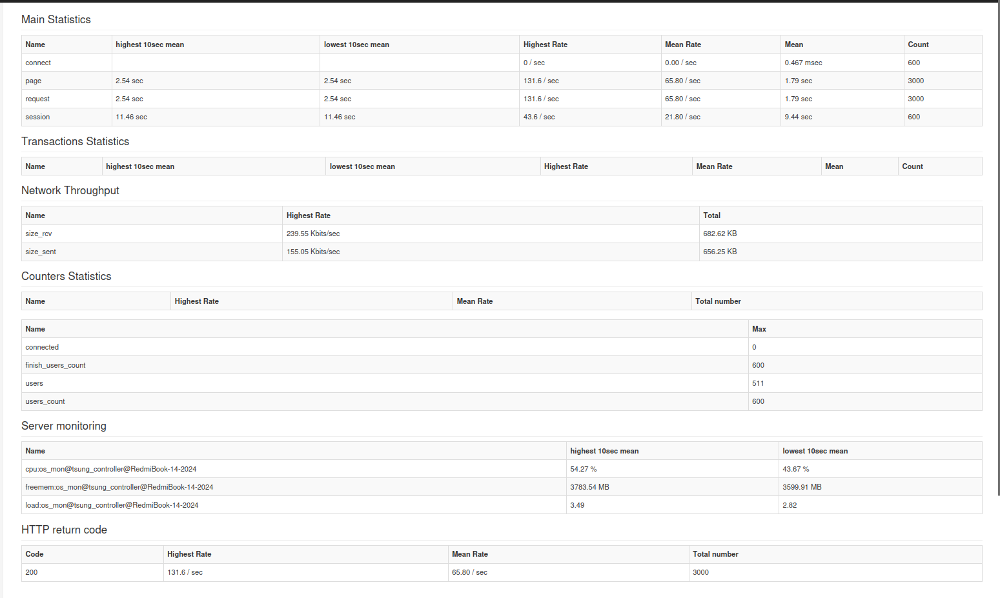
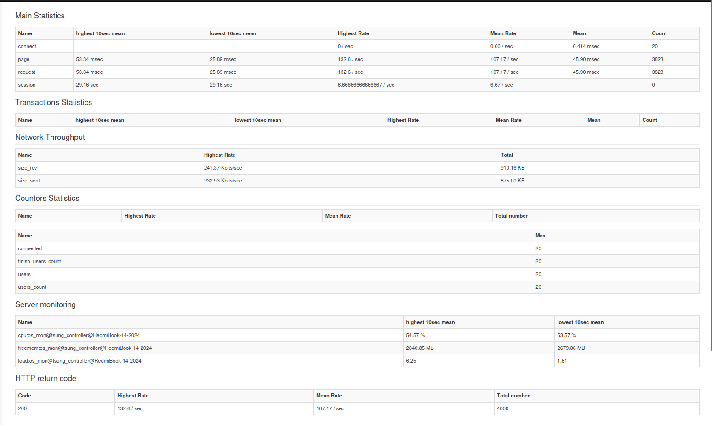

### Шардирование
Исследуем скорость работы системы после внедрения репликации.  
Имеем два `replicaSet` из трёх копий БД с асинхронным механизмом репликации. Запросы идут  
через `mongos`-роутер в два реплика-сета.

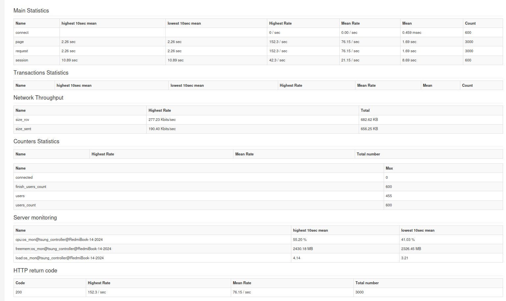
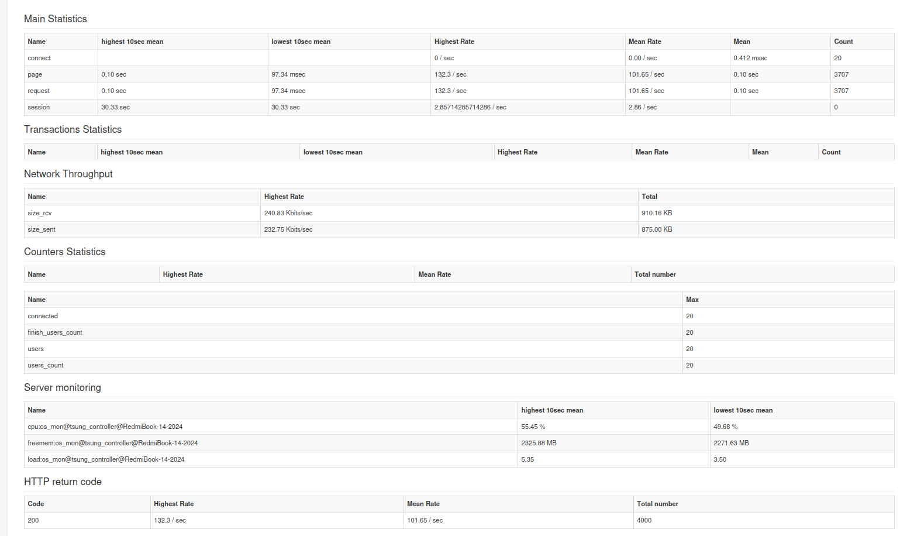
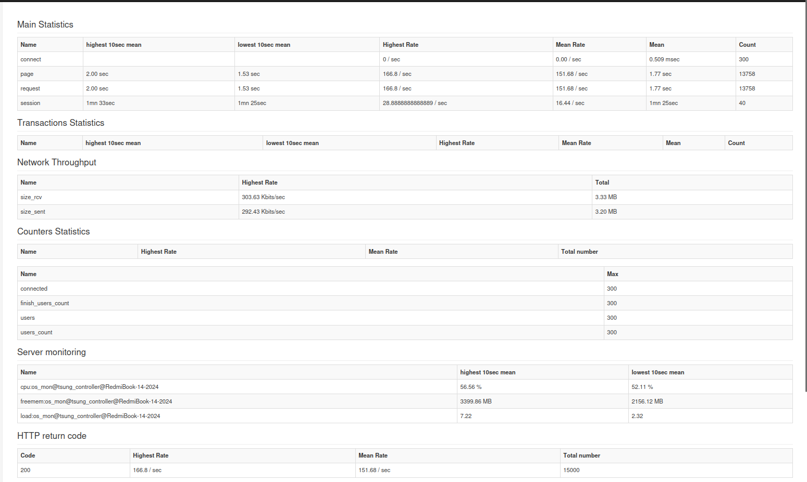

## Сводная таблица всех результатов тестирования
| Название опыта   | Время на запрос (с) | Клиентов | Сообщений | 
|------------------|---------------------|----------|-----------|
| mcfr-replication | 2.54                | 600      | 3000      |
| mrfc-replication | 0.5334              | 20       | 4000      |
| mcmr-replication | 2.08                | 300      | 15000     |
| mcfr-sharding    | 2.26                | 600      | 3000      |
| mrfc-sharding    | 0.10                | 20       | 4000      |
| mcmr-sharding    | 2.00                | 300      | 15000     |
| no-cache         | 0.04                | 1        | 1         |
| with-cache       | 0.157               | 1        | 1         |

## Выводы
Из таблицы видно, что:
1. Шардирование дало прирост по сравнению с репликацией от 4 до 13%. Прирост обусловлен тем, что вставка выполняется  
параллельно после момента обработки роутером.
2. Прирост производительности после введения кэширования составил `39.25` раз. 